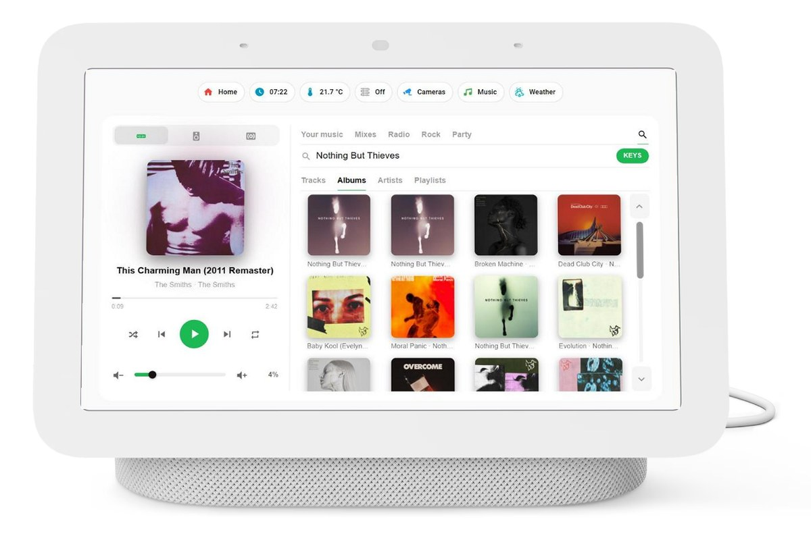
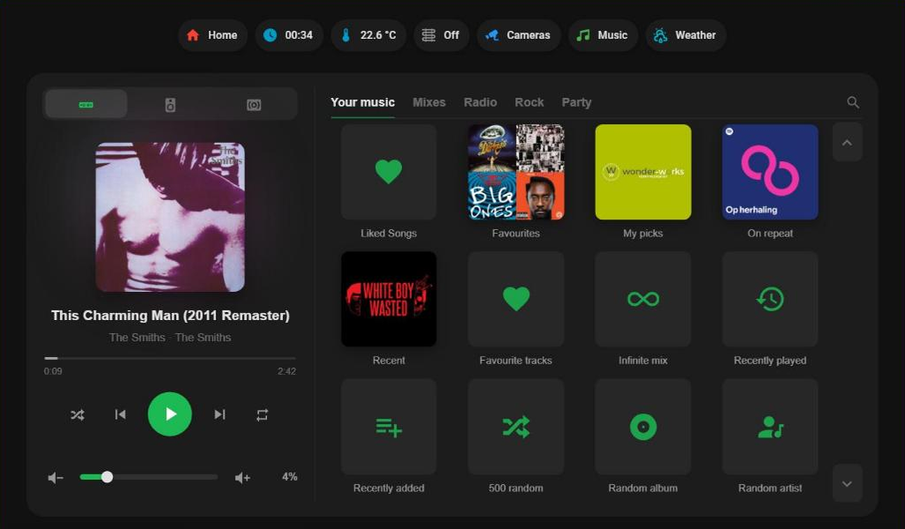
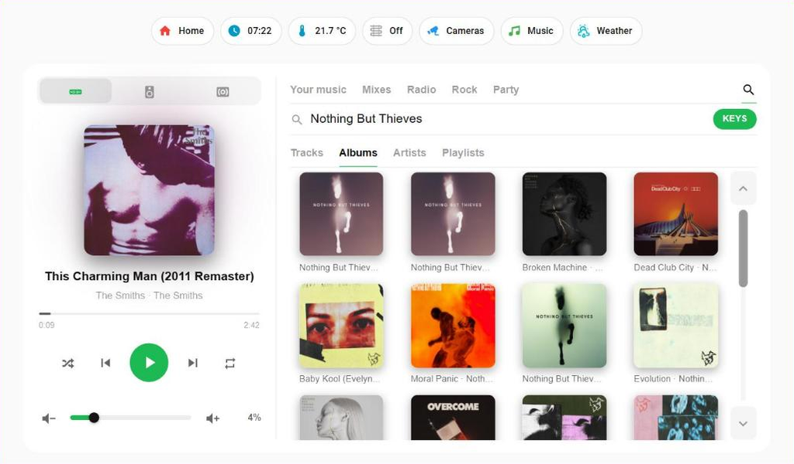
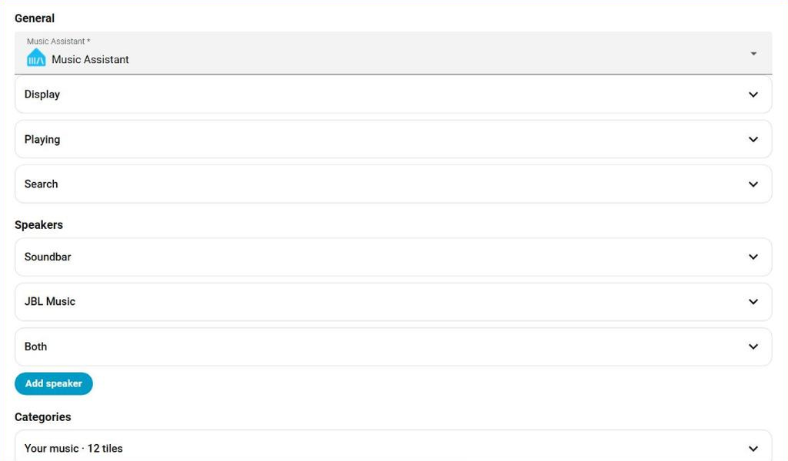

# Touch music card



A Lovelace card that puts Music Assistant behind one screen, built for touch panels and for Google Nest Hub cast dashboards at 1024×600.

It was written for a second-hand Nest Hub on a desk. Speaking to such a panel hands you back to Google and closes the dashboard you were looking at, and it has no keyboard, so a music card there has to be something you can drive entirely with your thumbs. That is what this is: speakers along the top, what is playing on the left, and everything you might want to start on the right.

The opening screen of the card in a dark theme:



## Does it need Spotify?

No. The card talks to **Music Assistant**, not to a music service.

| What | How |
| --- | --- |
| Searching | `music_assistant.search` |
| Starting something | `music_assistant.play_media` |
| Opening an album, artist or playlist | `media_player/browse_media` |

Music Assistant answers with whatever providers you have enabled — local files, Jellyfin, Plex, Navidrome, Subsonic, YouTube Music, Apple Music, Deezer, Tidal, Qobuz, SoundCloud, radio. The card never learns which one answered, and there is no service account, token or integration for it to care about beyond Music Assistant itself.

One Spotify-shaped detail is worth naming, because you will find it in the source. The card rewrites Spotify's CDN image URLs to a smaller size before putting a cover on screen, which keeps a Nest Hub quick. It is a plain text replacement: a URL from any other provider passes through untouched and the image works normally — it is just the original size, so it loads slower. If that bothers you, give the tile its own `image:` URL, or add a rewrite rule of your own at the top of the file.

## What it does

**Speakers as zones.** A row of buttons for the players and groups you care about. Switching while something is playing moves the queue across, so the music follows you rather than stopping. A zone can turn a group off or join speakers together first; see the caveat under `before` before you use it.

**A volume slider that fits the speaker.** A soundbar can already be loud at 20%, which leaves you fiddling in the first fifth of the slider. Set `volume_max: 20` and the whole slider maps onto 0–20%. The card writes a volume only when you move the slider or press the buttons — it never quietly sets one for you.

**Tiles for what you actually play.** Categories of tiles with cover art: your playlists, your radio stations, a daily mix. Tapping one opens its tracks, or plays it straight away if you would rather.

**Categories that fill themselves.** A category can be a list you write, or a question you ask Music Assistant — recently played playlists, your favourites, a random dozen albums. See [Categories](#categories-by-hand-or-filled-for-you).

**Covers that do not go stale.** A tile does not need an image URL. The card asks Music Assistant what the cover is now, so a playlist that changes its artwork changes on the card too. Pin an `image:` only when you want a particular one.

**Search with its own keyboard.** Tracks, albums, artists and playlists, with an on-screen keyboard because the panel has none. Results drill down: an album opens its tracks, an artist opens their albums.



**Light or dark from the theme it sits in.** The card measures the background its own theme gives it, not the operating system's preference. A view can carry a theme of its own, so a light dashboard on a laptop set to dark mode still gets dark text.

**A form for everything.** Speakers, categories, tiles, navigation buttons: all of it from the dashboard editor, no YAML needed. The code editor keeps working and stays authoritative for keys the form does not know about.



## Install

HACS does not list this card, so add it as a custom repository:

1. HACS → three dots at the top right → **Custom repositories**
2. URL: `https://github.com/mnrgrrt/touch-music-card`, category **Dashboard**
3. Install **Touch music card**, then hard-refresh your browser

Or copy `touch-music-card.js` to `config/www/` yourself and add it under Settings → Dashboards → three dots → Resources as `/local/touch-music-card.js`, type JavaScript module.

You need the [Music Assistant](https://www.music-assistant.io/) integration set up with at least one provider and at least one player. Nothing else.

## Getting started

There is nothing to look up or type in. Edit a dashboard, **Add card**, and pick **Touch music card** from the list.

- **One Music Assistant** — the card finds it by itself and fills it in.
- **More than one** — choose the right one from the *Music Assistant* dropdown at the top of the editor.

The new card starts with one category, *Recently played*, which Music Assistant fills for you, so there is something to tap straight away. Add your speakers under *Zones* and you are done. Everything else is optional.

If you prefer YAML, the same card looks like this. `config_entry_id` is the value the dropdown writes for you; the one below is only an example.

```yaml
type: custom:touch-music-card
config_entry_id: 01JXXXXXXXXXXXXXXXXXXXXXXX
zones:
  - name: Kitchen
    entity: media_player.kitchen
categories:
  - name: Recently played
    source:
      media_type: playlist
      order_by: last_played_desc
      limit: 12
```

## Categories: by hand or filled for you

Each category answers one question in the editor: **do you write the list, or does Music Assistant?**

*By hand* is what you want for taste. "Rock" and "Party" are a choice, and a choice has an order you picked. You add tiles one at a time.

*Filled by Music Assistant* is what you want for anything that moves on its own:

```yaml
categories:
  - name: Recently played
    source:
      media_type: playlist
      order_by: last_played_desc
      limit: 12
  - name: Favourites
    source:
      media_type: playlist
      favorite: true
      limit: 24
  - name: Something else
    source:
      media_type: album
      order_by: random
      limit: 12
```

The card asks `music_assistant.get_library` and shows what comes back, cover art included. Your steering wheel is Music Assistant itself: mark something as a favourite there and it turns up in a `favorite: true` category on its own.

A source category has no `tiles` of its own, and you cannot reorder it — that is the trade you make for it staying current.

### How this stays fast

A cast dashboard is open for days and a Nest Hub is not quick, so the rule is that **drawing never waits for the network**. The card paints what it already knows, asks for the rest in the background, and redraws once when it arrives.

Around that:

- One fetch per distinct source, cached for ten minutes, shared between categories that ask the same thing
- Requests that arrive while one is in flight join it rather than starting a second
- Covers are looked up in one library fetch per media type, not one per tile — and not at all for a tile that pins its own `image`
- A failed fetch is remembered for the same ten minutes, so a Music Assistant that is down does not turn every redraw into another attempt

In practice: one or two service calls when the card first appears, and then nothing until the cache expires.

### One caveat about covers

Most covers come straight from the provider over https and load anywhere. The exception is an item Music Assistant has no artwork for and proxies itself: it answers with its own address, `http://<your-ma-host>:8095/imageproxy/…`, and a dashboard served over https refuses to load that as mixed content.

The card treats such a URL as absent and falls back to the tile's icon. On a streaming-only library that is not a workaround but the better result: the handful of items affected are the smart playlists — recently played, random album, all favourites — and they have no artwork to show, only one generic placeholder shared between them. An icon reads better than that, and the card asks for nothing it will not use.

It starts to matter once you have local music whose album art Music Assistant proxies, because then those URLs carry real covers. The fix is not in the card: give Music Assistant an https address of its own through a reverse proxy and set that as its base URL. Check what else that address is used for before committing to it — stream URLs may follow it.

## Finding media ids

Tiles are the one place where the editor cannot help you: `uri` is a text box, and nothing on screen tells you what belongs in it.

Go to **Developer tools → Actions → "Music Assistant: Search"**, choose your Music Assistant entry, fill in a name and a media type, and run it. The response gives you exactly what a tile needs:

```yaml
playlists:
  - media_type: playlist
    uri: library://playlist/65
    name: Op repeat
    image: https://pickasso.spotifycdn.com/image/...
```

Copy `uri` into the tile, and `image` too if you want that cover.

Prefer `library://` ids where you can. Those are Music Assistant's own library numbers, so they keep working if you ever switch providers. They are also specific to your installation — the number 65 above means nothing on anyone else's system, which is why a configuration copied from someone else never works as-is.

## Options

### Card

| Key | Default | What it does |
| --- | --- | --- |
| `config_entry_id` | filled in | Your Music Assistant integration. Filled in for you when there is only one; otherwise picked from the dropdown. |
| `zones` | — | The speakers along the top. |
| `categories` | — | Groups of tiles on the right. |
| `links` | — | Navigation buttons to other dashboard views. |
| `height` | `556` | Fixed height in pixels. |
| `fill` | `false` | Work out the height from the space available instead. |
| `fill_margin` | `8` | Space to leave at the bottom when filling. |
| `volume_max` | `100` | The end of the slider, in percent. |
| `volume_start` | — | Drop back to this percentage when starting above `volume_max`. Leave it out and the card never touches your volume on its own. |
| `limit` | `24` | Search results per type. |
| `search_types` | all four | Which of track, album, artist, playlist can be searched. |
| `tile_action` | `open` | `open` shows a tile's tracks, `play` starts it straight away. |
| `keyboard` | `true` | The on-screen keyboard. Set `false` on a phone or PC to use a normal text field. |
| `arrows` | `true` | Scroll buttons beside the lists, for panels without a scrollbar. |
| `transfer_on_switch` | `true` | Move the queue along when you switch speaker. `false` switches the view only. |
| `retry_next` | `true` | Re-send a skip if nothing happens, which Chromecast players sometimes need. |
| `language` | follows HA | `nl` or `en`. |

### Zone

| Key | Default | What it does |
| --- | --- | --- |
| `name` | — | The label on the button. |
| `entity` | — | A Music Assistant `media_player`, a single speaker or a group. |
| `icon` | — | One of the card's built-in icons, or an `mdi:` name. |
| `volume` | `entity` | Send volume to a different entity than the one that plays. |
| `volume_max` | inherits | Override the slider range for this zone. |
| `volume_start` | inherits | Override the fallback volume for this zone. |
| `before` | — | Switch a group off, detach speakers, or join them together before playing here. |

**A warning about `before: turn_off`.** If the player you switch off shares its queue with the player you are switching to — which is what a Music Assistant group and its members do — then switching it off empties that queue, and the queue transfer that follows finds nothing to move. The music stops instead of following you. The card guards against this by deferring such a switch-off until after the transfer, and falls back to restarting the track if Music Assistant refuses the transfer anyway. Even so: if a zone is a member of the group you are turning off, you usually do not need `before` at all. The transfer moves playback off the group by itself.

### Category

| Key | Default | What it does |
| --- | --- | --- |
| `name` | — | The heading above the tiles. |
| `tiles` | — | The tiles in this category, written by you. |
| `source` | — | Let Music Assistant fill it instead. Replaces `tiles`. |

### Source

| Key | Default | What it does |
| --- | --- | --- |
| `media_type` | `playlist` | `playlist`, `album`, `artist` or `track`. |
| `limit` | `12` | How many tiles. |
| `order_by` | library order | `last_played_desc`, `timestamp_added_desc` or `random`. |
| `favorite` | `false` | Only what is marked as a favourite in Music Assistant. |
| `play` | `false` | Tapping a tile plays it straight away instead of opening it. |

### Tile

| Key | Default | What it does |
| --- | --- | --- |
| `uri` | — | Required. A Music Assistant media id — see [Finding media ids](#finding-media-ids). |
| `name` | — | The label under the tile. |
| `image` | fetched | A cover image URL. Leave it out and the card uses whatever cover Music Assistant has for this `uri` right now; set it to pin one particular image. If neither exists, the tile shows its icon. |
| `icon` | — | One of the card's built-in icons, or an `mdi:` name. |
| `play` | `false` | Always play this tile straight away, whatever `tile_action` says. |
| `radio_mode` | `false` | Start it in Music Assistant's radio mode, which keeps picking similar tracks. |

### Navigation button

| Key | Default | What it does |
| --- | --- | --- |
| `name` | — | The label. |
| `icon` | — | An icon beside it. |
| `path` | — | A dashboard path, for example `/nesthub/home`. |

## Status

This runs on my own Nest Hub every day. I made it for myself, and I am sharing it because someone else might have the same small screen on their desk.

I would really like to hear what you think of it. Are you using it, and on what? Did you change something, or build something on top of it? Is there an idea that would make it better? Open an [issue](https://github.com/mnrgrrt/touch-music-card/issues) and tell me — good ideas are very welcome, and so is simply telling me it works for you.

Be aware that I do not maintain it actively. I work on it now and then when I have time, so an answer or a fix can take a while. Pull requests are welcome and I will look at them, and you are free to fork it and make it your own without asking.

It is one file with no build step — no npm, no bundler, no TypeScript. Open it in an editor and change what you want. That is deliberate.

## Licence

MIT. See [LICENSE](LICENSE).
